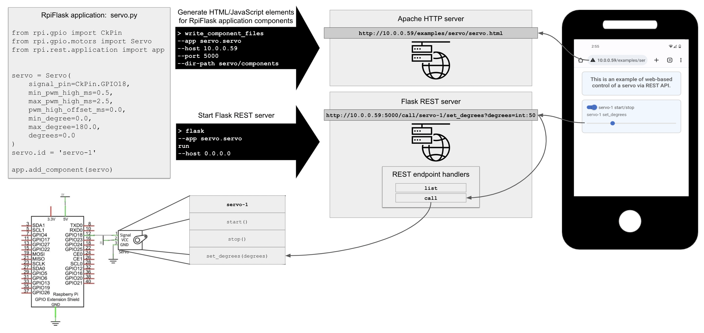

# RPI

# Overview
This package provides two related capabilities. First, it provides a high-level, event-driven Python interface for GPIO 
circuits running on the Raspberry Pi. Sensors, motors, LEDs, switches, and many other components are covered. 
Second, this package enables remote control of such circuits via REST APIs invoked from HTML/JavaScript front-ends. Want 
to control your servo motor remotely from your phone? Look no further. This package auto-generates HTML/JavaScript 
snippets based on [Material Design for Bootstrap](https://mdbootstrap.com), and these snippets can be embedded in web 
pages for remote control of the REST APIs. These two capabilities are described in more detail below.

# Python Interface for GPIO Circuits
Whereas the lower-level [RPi.GPIO](https://pypi.org/project/RPi.GPIO/) package deals with GPIO input/output pins and 
high/low values, the RPI package deals with LEDs that are on or off, button switches that are pressed or not, and so on. 
These abstractions, in combination with an event-driven framework, allow the developer to express the intended circuit 
behavior more naturally compared with lower-level interfaces. For example, a blinking LED program is written as follows:
```python
import time
from rpi.gpio import setup, cleanup
from rpi.gpio.lights import LED

setup()

# create an led on output pin 11
led = LED(output_pin=11)

# set on for 1 second then off
led.turn_on()
time.sleep(1)
led.turn_off()

cleanup()
```
A button-switched LED is shown below:

```python
import time

from rpi.gpio import setup, cleanup
from rpi.gpio.lights import LED
from rpi.gpio.controls import TwoPoleButton

setup()

# create an led on output pin 11
led = LED(output_pin=11)

# create a button on input pin 12
button = TwoPoleButton(input_pin=12, bounce_time_ms=300)

# turn the led on when the button is pressed
button.event(lambda s: led.turn_on() if s.pressed else led.turn_off())

print('You have 20 seconds to press the button...')
time.sleep(20)

cleanup()
```

Still more examples:

Buzzing LED bar with push button (click to watch; Python code [here](https://github.com/MatthewGerber/rpi/blob/main/src/rpi/gpio/examples/buzzing_led_bar_with_button.py)):
[](https://www.youtube.com/watch?v=e6PrM2QVSA4)

Python code for these and other examples can be found [here](src/rpi/gpio/examples).

# Remote Control of GPIO Circuits via REST/HTML/JavaScript
Remote control of GPIO circuits is achieved by integrating three components:
* RpiFlask application:  Instantiates the GPIO circuit components using the Python types described above.
* Apache HTTP server:  Serves web pages for the RpiFlask application, to be accessed from remote devices like a phone.
* Flask REST server:  Serves REST endpoints that web page elements (e.g., toggles and sliders) can invoke to control
the GPIO circuit (e.g., turning a servo motor on/off and setting its angular position).

These components are depicted graphically below and described in more detail in the following sections.



A key feature of the present package is that, once the GPIO circuit is built (bottom left of the figure) and the 
RpiFlask application is written (top left of the figure), generating the HTML/JavaScript elements and the REST endpoints
is almost fully automated.

## RpiFlask Application
TODO

## Apache HTTP Server
TODO 
1. [Install and configure](https://ubuntu.com/tutorials/install-and-configure-apache#1-overview) an Apache HTTP server.

## Flask REST Server
TODO

# Ubuntu for RPI with GPIO Configuration
This package has been developed using the Ubuntu installation described 
[here](https://matthewgerber.github.io/rlai/raspberry_pi.html#operating-system) (ignore the "Install RLAI" section). By 
default, Ubuntu does not give the user permission to interact with the GPIO pins of the Raspberry Pi. To grant GPIO 
permissions when the Raspberry Pi boots:
1. Edit `/etc/udev/rules.d/99-gpiomem.rules` as follows to assign all `gpio*` device to the `dialout` group, which the 
user is a member of by default:
```
KERNEL=="gpio*", OWNER="root", GROUP="dialout"
```
2. Reboot for the new permissions to take effect.

Use of I2C with the Raspberry Pi (e.g., page 111 of the tutorial) requires configuration with the `raspi-config` 
utility, which is installed by default in the Raspberry Pi OS but not in Ubuntu. Install `raspi-config` for Ubuntu with 
the following commands:
```
sudo apt install lua5.1
wget http://archive.raspberrypi.org/debian/pool/main/r/raspi-config/raspi-config_20211019_all.deb
sudo dpkg -i raspi-config_20211019_all.deb
```
A full listing of the latest `raspi-config` packages can be found 
[here](http://archive.raspberrypi.org/debian/pool/main/r/raspi-config). The user will also need to be added to the 
`i2c` group with `sudo usermod -a -G i2c ubuntu` (then restart for the change to take effect).
