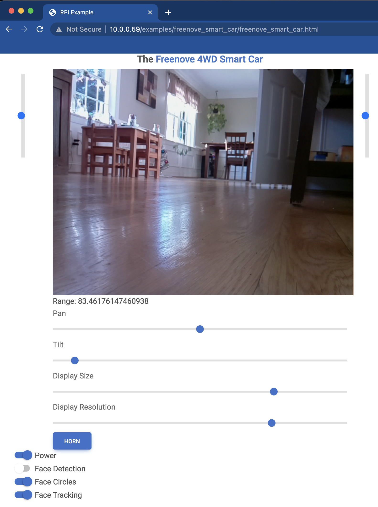

[](https://badge.fury.io/py/raspberry-py)

Please see the [project website](https://matthewgerber.github.io/raspberry-py/) for more information.

# Python Interface for GPIO Circuits
This package provides two related capabilities. 
[First](https://matthewgerber.github.io/raspberry-py/python-gpio.html), it provides a high-level, event-driven Python 
interface for GPIO circuits running on the Raspberry Pi. Sensors, motors, LEDs, switches, and many other components are 
covered. An example is shown below (click to watch; Python code
[here](https://github.com/MatthewGerber/raspberry-py/blob/main/src/raspberry_py/gpio/examples/buzzing_led_bar_with_button.py)):

[](https://www.youtube.com/watch?v=e6PrM2QVSA4)

# Remote Control of GPIO Circuits via REST/HTML/JavaScript
[Second](https://matthewgerber.github.io/raspberry-py/remote-gpio.html), this package enables remote control of GPIO 
circuits via REST APIs invoked from HTML/JavaScript front-ends. Want to control your circuit remotely from your phone? 
Look no further. This package auto-generates HTML/JavaScript for GPIO circuits based on
[Material Design for Bootstrap](https://mdbootstrap.com). These HTML/JavaScript elements can be embedded in full web 
pages for remote control of the circuit. The remote control screen for the 
[Freenove Smart Car](https://matthewgerber.github.io/raspberry-py/smart-car.html) is shown below:



The smart car is built from the same components (sensors, motors, LEDs, etc.) listed above, making development quite 
straightforward. As another example, consider 
[the 3D-printed robotic arm](https://matthewgerber.github.io/raspberry-py/smart-car.html#enhancement-robotic-arm) that I 
designed for the car.

Please see the [project website](https://matthewgerber.github.io/raspberry-py/) for more information.

# Bumping, Tagging, and Releasing Versions with Poetry
We follow 
[semantic versioning](https://semver.org/) and [Python Packaging](https://packaging.python.org/en/latest/specifications/version-specifiers/#version-specifiers)
specifications when bumping and releasing.

## Prerelease
Prereleases are useful for testing changes prior to an official release. These releases include alpha (`a`), beta (`b`), 
and release candidate (`rc`) versions, which are successively mature release phases on the path to an official release.

Bump the minor prerelease (e.g., `0.2.0` → `0.3.0a0`):
```shell
OLD_VERSION=$(poetry version --short)
poetry version preminor
VERSION=$(poetry version --short)
git commit -a -m "Bump minor prerelease:  ${OLD_VERSION} → ${VERSION}"
git push
```

Bump the prerelease number within the current prerelease phase (e.g., `0.1.0a0` → `0.1.0a1`):
```shell
OLD_VERSION=$(poetry version --short)
poetry version prerelease
VERSION=$(poetry version --short)
git commit -a -m "Bump prerelease number:  ${OLD_VERSION} → ${VERSION}"
git push
```

Bump the prerelease phase (e.g., `0.1.0a1` → `0.1.0b0`):
```shell
OLD_VERSION=$(poetry version --short)
poetry version prerelease --next-phase
VERSION=$(poetry version --short)
git commit -a -m "Bump prerelease phase:  ${OLD_VERSION} → ${VERSION}"
git push
```
The prerelease phases progress as alpha (`a`), beta (`b`), and release candidate (`rc`), each time resetting to a 
prerelease number of 0. After `rc`, the prerelease suffix (e.g., `rc3`) is stripped, leaving the 
`major.minor.patch` release version.

## Patch
A patch release fixes one or more issues in a previous release.

Bump the patch version (e.g., `0.1.0b1` → `0.1.1`):
```shell
OLD_VERSION=$(poetry version --short)
poetry version patch
VERSION=$(poetry version --short)
git commit -a -m "Bump patch:  ${OLD_VERSION} → ${VERSION}"
git push
```

## Minor
A minor release adds functionality in a backwards compatible fashion.

Bump the minor version (e.g., `0.1.0b1` → `0.1.0`):
```shell
OLD_VERSION=$(poetry version --short)
poetry version minor
VERSION=$(poetry version --short)
git commit -a -m "Bump minor:  ${OLD_VERSION} → ${VERSION}"
git push
```

## Major
A major release adds functionality in a backwards incompatible fashion.

Bump the major version (e.g., `0.1.0a0` → `2.0.0`):
```shell
OLD_VERSION=$(poetry version --short)
poetry version major
VERSION=$(poetry version --short)
git commit -a -m "Bump major:  ${OLD_VERSION} → ${VERSION}"
git push
```

## Tagging
Tagging the current version enables the publication of a new release to PyPI via GitHub workflow. Tag the current 
version (e.g., `v2.0.0`):
```shell
VERSION=$(poetry version --short)
git tag -a -m "version ${VERSION}" "v${VERSION}"
git push --follow-tags
```
Then create a new release from the tag. Doing this will trigger the publication workflow to run, which builds a 
new release and uploads it to PyPI.