[Home](index.md) > [CAD Parts](cad-parts.md) > Brushed DC Motor
* Content
{:toc}

<iframe src="https://gmail3021534.autodesk360.com/shares/public/SH512d4QTec90decfa6ee884568e9083a6b5?mode=embed" width="800" height="600" allowfullscreen="true" webkitallowfullscreen="true" mozallowfullscreen="true"  frameborder="0"></iframe>



# Materials and Equipment

Required:
* [Copper sheet](https://www.amazon.com/dp/B0C1ZZLR97?th=1):  Used to build commutator plates.
* [30 AWG enameled magnet wire](https://www.amazon.com/dp/B00UWCXRK6?th=1):  Used to create electromagnetic windings.
* [Soft iron rod](https://www.amazon.com/dp/B0BNNCZ4ZR):  Enhances the field strength of electromagnetic windings.
* Hacksaw:  Or some other way to cut lengths of the soft iron rod.
* [Ceramic magnets](https://www.amazon.com/dp/B07S75MD7X?th=1):  Form the fixed stator fields of the motor.
* [Bearings](https://www.amazon.com/dp/B07B8VZJGD):  Holds the rotor.
* [Carbon motor brushes](https://www.amazon.com/dp/B07CVT2TG8):  Conducts current from a source to the commutator by physical contact.
* [Superglue](https://www.amazon.com/dp/B00ELV2D0Y):  Used in a couple spots to hold parts together (e.g., commutator plates to the rotor).
* Thin-gauge wire (e.g., 22 AWG jumper cables as provided in kits like [this](https://www.amazon.com/gp/product/B06W54L7B5/ref=ppx_yo_dt_b_search_asin_title?ie=UTF8&psc=1)):  For providing current to the carbon motor brushes.
* Soldering iron:  Wire connections.
* Solder:  Wire connections.
* [DC power supply](https://www.amazon.com/gp/product/B087LY94T6/ref=ppx_yo_dt_b_search_asin_title?ie=UTF8&th=1):
  This is usable depending on the total resistance of the windings. If the resistance is too low because the 
  windings are too small, then this power supply will short and self-disable. However, this supply works fine in all 
  builds of the motors described on this page. If you go with this power supply, then also get a 
  [DC power jack](https://www.amazon.com/dp/B00QJAW9F4?ref=ppx_yo2ov_dt_b_product_details&th=1) to connect the 
  supply to the carbon motor brushes. It should be possible to wire several batteries together for power, but I do 
  not provide instructions for this. I can only say that a single 9-volt battery is insufficient. I tried it, and it 
  was not strong enough. 
* Lots of patience:  It takes several hours to print the plastic parts and then several more hours to build and 
  assemble, assuming you get it right the first time, which is not assured!

Optional but useful:
* [Electrical tape](https://www.amazon.com/Duck-299004-Professional-Electrical-0-75-Inch/dp/B007JSGNWU/):  To wrap the coils.
* [Soldering station](https://www.amazon.com/dp/B0BHHVP467?ref=ppx_yo2ov_dt_b_product_details&th=1):  The 
  connections, particularly to the commutator, are difficult to solder without this handy tool. 
* [Shrink tubing](https://www.amazon.com/dp/B01MFA3OFA?ref=ppx_yo2ov_dt_b_product_details&th=1):  For soldered connections.
* [Autoranging multimeter](https://www.amazon.com/s?k=autoranging+multimeter&crid=2RJH49VDBDN9Y&sprefix=autoranging%2Caps%2C68&ref=nb_sb_ss_ts-doa-p_1_11):  Very 
  helpful when checking winding resistance and circuit integrity.
* [Alligator clips](https://www.amazon.com/gp/product/B09RZQFGGH/ref=ppx_yo_dt_b_search_asin_title?ie=UTF8&psc=1):  Useful when checking circuits and changing wiring.
* [Files](https://www.amazon.com/Hardened-Strength-Barrette-Crossing-Equaling/dp/B07PPYWSCY/):  Removing extraneous 
  plastic when assembling parts.
* [Vise](https://www.amazon.com/GOXAWEE-Bench-Clamp-Workbench-Woodworking/dp/B09N6Y2C29/):  Useful when cutting 
  segments of the iron rod and winding the electromagnetic coils.   
* [Circuit breadboard](https://www.amazon.com/gp/product/B07LFD4LT6/):  Useful when building circuitry around the 
  motor such as on/off switches and relays, LED indicators, and tachometers.

# Print the Parts

See [here](cad-parts.md) for the 3d-printing tech that I use. Links to part files for particular designs can be 
found at the bottom of this page. A few printing tips:
* It's possible to lay out all parts for a single print, as long as your printer's build volume is sufficiently large.
* The winding holder prints best when it is lying flat with the central rotor hole vertical. To assist with this, I 
  have added a small planar surface that is tangent to the circular holder. This surface is highlighted in green 
  below:

  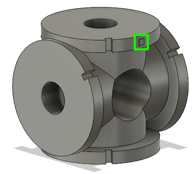

  The Cura slicer software allows the user to click any planar surface to lie flat on the build plate. Simply click 
  the highlighted surface, and the winding holder will lie perfectly flat as intended. All of the other surfaces on 
  the holder are curved, so it is difficult to lie the piece flat without this planar surface.
* The print takes around 8-10 hours on my Ender 3.
* The most difficult supports to remove from the print are the ones that reside within the carbon brush houses as 
  shown in blue below:

  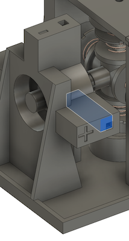

  Using a small flat-edge screwdriver, gradually press through the exterior hole and shove the internal supports 
  out the other end. This can be quite challenging, but the supports will eventually come out. The other supports in 
  the print are easier to remove.
* The rotor (shaft) might not fit easily within the bearings at first. File or sand the the rotor so that it fits in 
  the bearings snugly. You don't want it to be loose within the bearings.

# Assemble the Windings

The soft iron winding cores need to leave 10mm exposed after insertion into the holder, as shown below:

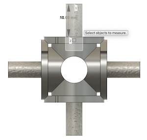
 
Insert the iron rod fully into the holder, mark off 10mm exposed, and cut to length. It is important to leave no more 
than 10mm exposed so that the windings clear the stators when rotating. Attach the winding washer to the end of the
core leaving 2mm exposed:

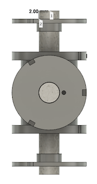

This bit on the end will be clamped in a drill when winding the electromagnetic coils. Repeat for all windings. 
Depending on the design (see below), there will be either two or four windings. Add a drop of superglue in the core 
holder to keep each iron core in place. Once these dry, position the winding washers on the ends of their cores. Do 
not glue them yet, just get them in place as follows:

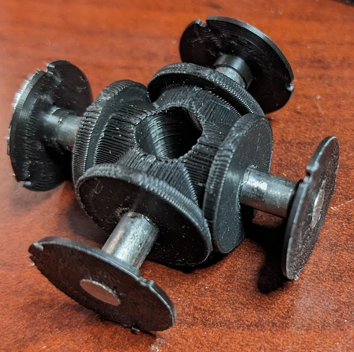

Note that the collar of each washer is facing the inside and not the outside. This is important. Next, for each washer 
in turn, place a small drop of superglue on the inside surface as circled in green below:

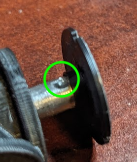

Move the washer inward while rotating it on the core, such that the glue enters between the core and the washer. When 
done, the washer should leave exactly 2mm of exposed core on the end. To make this easy, print the small spacer part and 
use it to push the washers inward. The spacer has a collar with depth 2mm.

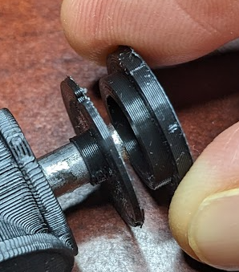

The assembly should look as follows after the washers are placed and glued:

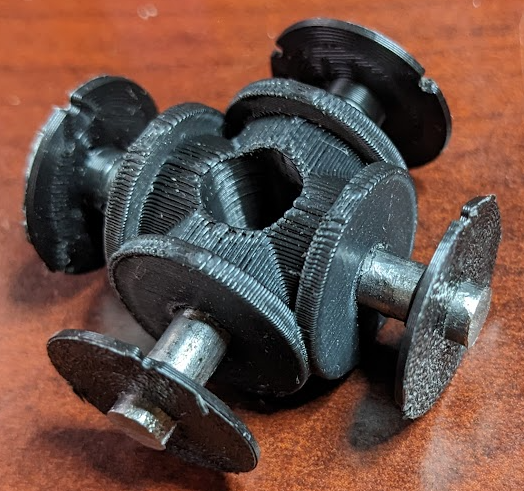

Let everything dry and then assemble the motor to ensure that it will rotate freely:



# Wind the Electromagnetic Coils

Each washer has a 1mm hole near the central hole as circled in green below. The purpose of this hole is to provide the 
magnet wire an exit from the coil and to get the winding started. 

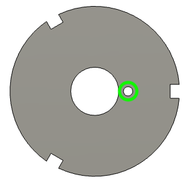

If your 3d printer is sufficiently accurate, then this hole will be present and will accept the 30 AWG enameled magnet
wire. If the hole is not preserved, then you might need to open it up with a pin. The coil should look as follows just 
prior to engaging the drill:

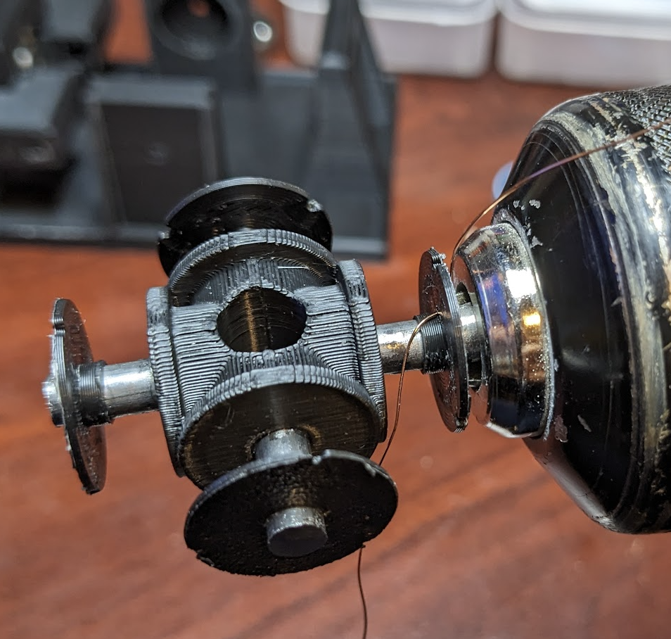

Note that a good length of wire has been pulled through the small hole exiting to the right (the wire spool lies below
the drill in the image). A good strategy is to clamp the drill in a vise, guide the feed wire with one hand, and operate
the drill with the other hand.

Now for the tricky part, the winding direction. Study up on the 
"right-hand rule" of electromagnetism. There are many good articles. [This](https://www.aplusphysics.com/courses/honors/magnets/electromagnetism.html) one is helpful, particularly the 
following visual:

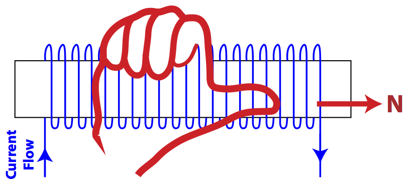

Another view of the right-hand rule is shown below, taken from one of the motor designs:

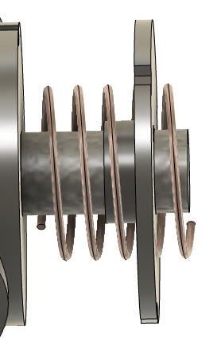

In the above, the outward-facing (right) end of the iron core would have north polarity.

The specific winding direction to use at this point depends on the design you are building. See the three designs below
for winding polarities to use for your design.

## Two-Stator Two-Coil Polarities

The red Xs in the figure below show parts that are not actually present in this design. The green arrows show the 
directions that the washers should turn when winding each coil. As shown, the washers on either end turn in the same 
direction. This means that the drill direction will remain the same throughout the entire winding procedure.

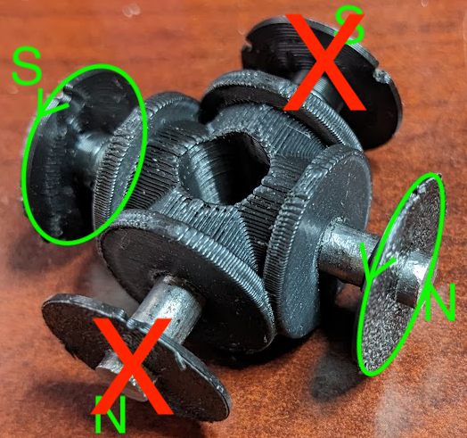

## Two-Stator Four-Coil Polarities

This is just like the two-stator two-coil design except that the magnets run along both axes.

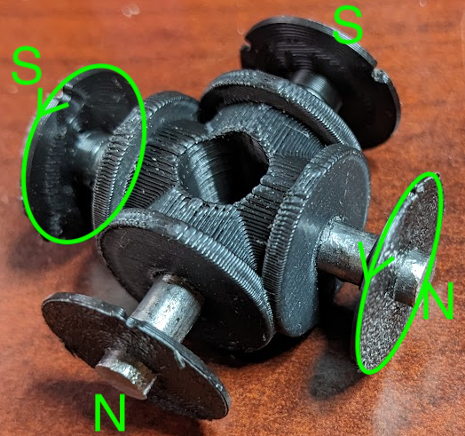

## Four-Stator Four-Coil Polarities

The polarities in this design must be such that each end is north. To achieve this, wind one end in the direction 
indicated in the image below. Once the first coil is wound, reverse the drill and wind the other coil in the 
opposite direction. Then wind the coils along the other axis in the same way.

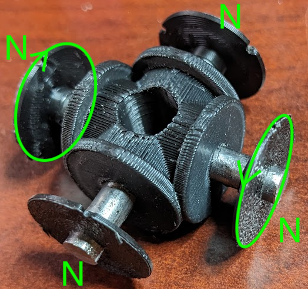

## Winding

When you're ready, _slowly_ start the drill and begin winding the coil. Try to get the layers as even as possible. Fill 
in the valleys that develop and don't worry about making them perfect. Stop the drill when the first coil is wound. 
Guide the feed-end of the wire across the winding holder using the notches as guides and then continue winding the other 
end in the direction shown according to your design above. Once the other end is complete, secure the wire, leave a good 
length exposed for later wiring, and then cut the wire:

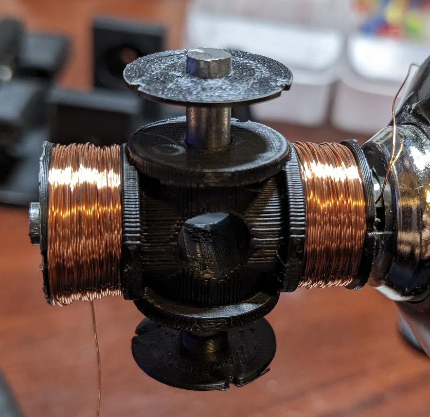

Wrap the coils in electrical tape. If your design involves coils along the other axis, then repeat the procedure to 
obtain the required polarities:

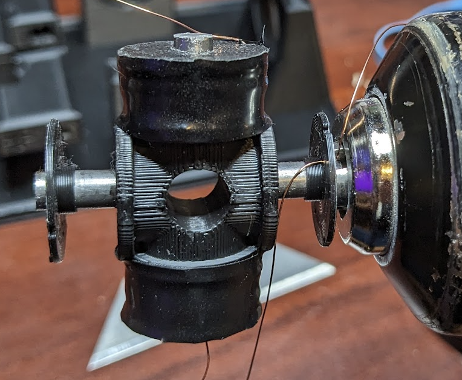

A final four-coil design should look as follows:

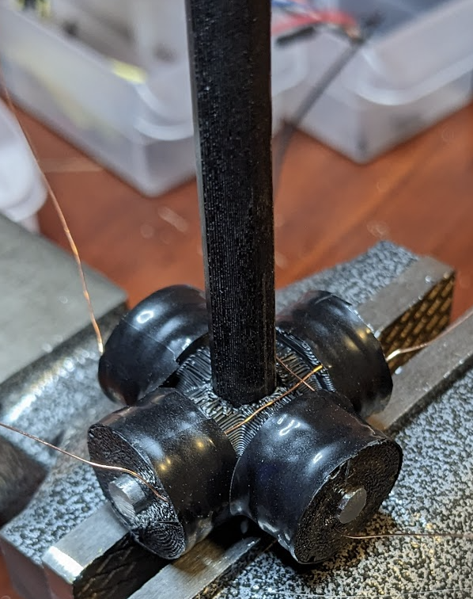

Use a multimeter to test all coils for integrity and roughly similar resistance. A few tips at this point:
1. The wire is enameled, meaning its coated in a thin layer of clear plastic to prevent shorts within the coil. The 
   enamel must be removed from the wire ends prior to testing or soldering. Simply burn it off with a flame.
2. Having built and wound several cores like these, I have found that each axis (two coils) typically has about 15 
   ohms of resistance. With a 12-volt power supply, this would result in 12.0 / 15.0 = 0.8 amps of current running 
   through the wire, which is acceptable. The final assembly including the commutator and brushes will have more 
   resistance, which will further decrease the current. The final current needs to be within the operating range of 
   the wire. [This](../manuals/coildata.xls) workbook suggests the fusing current of 30 AWG wire is 10 amps, so the 
   final current running through the coils must be substantially below this.

# Build the Commutator

Cut a width of copper sheet that will fit within the recessed sections of the rotor:

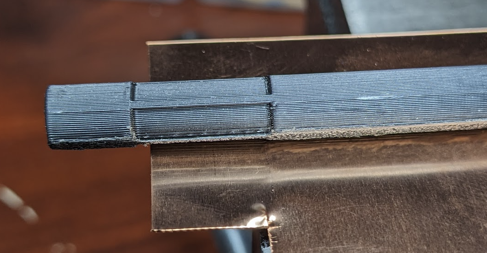

Place the section in the bender:

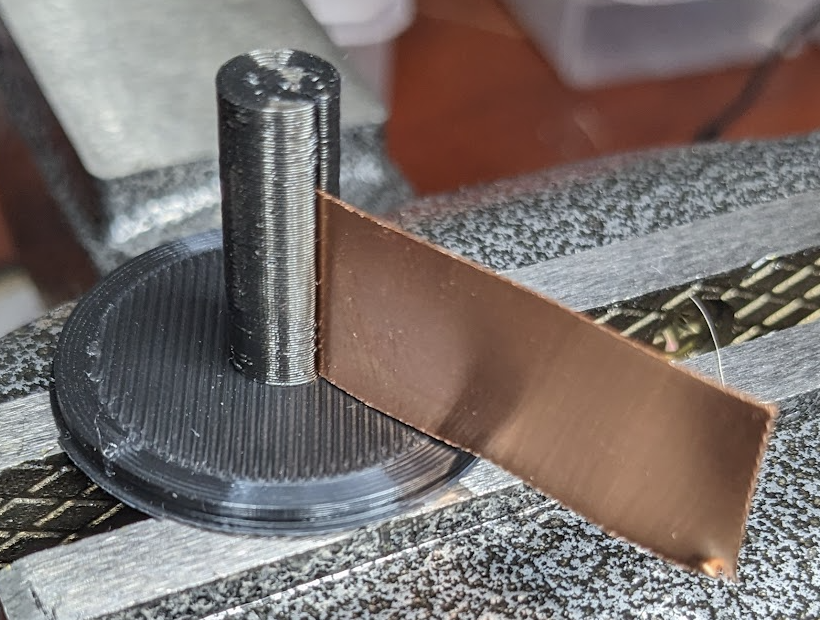

The outside diameter of bender is the same as the recessed sections of the rotor. Thus, wrapping the copper around 
the bender provides a curvature that will match the recesses of the rotor:

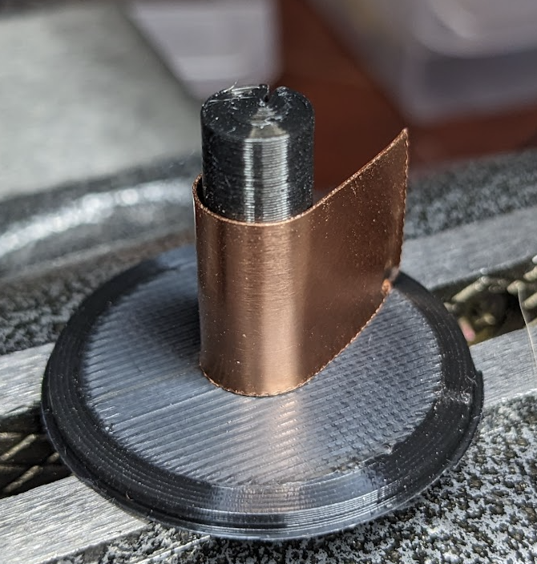

Cut sections of the bent copper that will lie in the recesses:

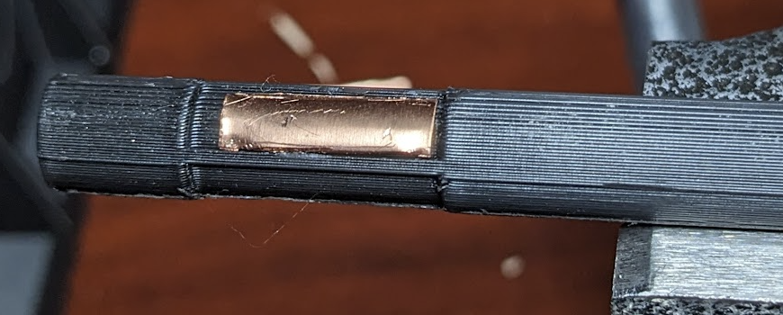

The commutator segments need to lie entirely within the recesses and not have rough edges that will catch on the 
brushes. Do not glue the segments to the rotator yet. They still need to be soldered to winding coils, and if you 
attempt to solder commutator segments while they are glued to the rotor, you will melt the plastic rotor.

Position the winding cores on the rotor and trim the wires to remove excessive wire:

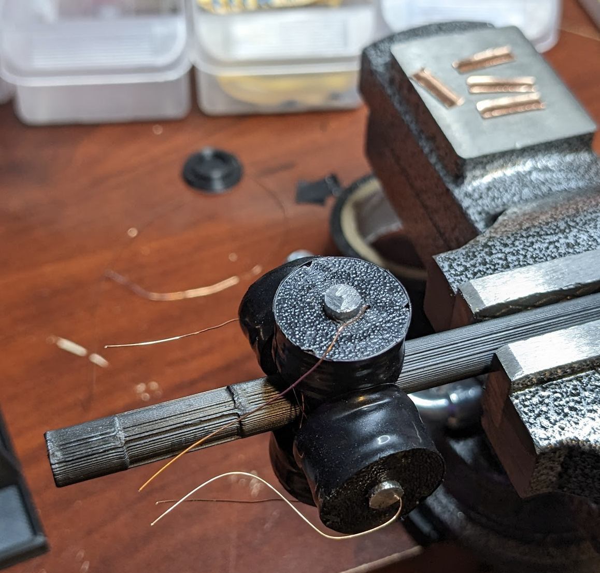

Next, solder the winding coils to the commutator:

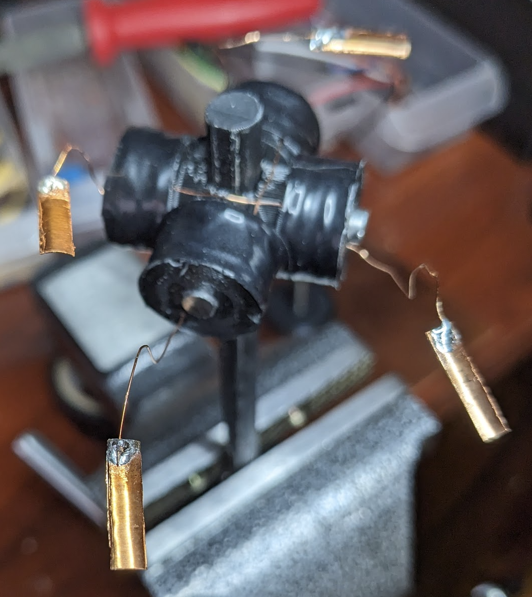

A few tips on this step:
1. The smooth copper sheet might not adhere well with the solder. File or sand the surface end of the commutator 
   segments that you will solder to the wires.
2. If you value your fingers, then use a soldering station as listed at the top of this page.
3. Do not allow the solder to go very far up the commutator segment. The brushes need room to run unimpeded across 
   the commutator surfaces.

Next position the winding holder precisely on the rotor and begin gluing them into their recesses:

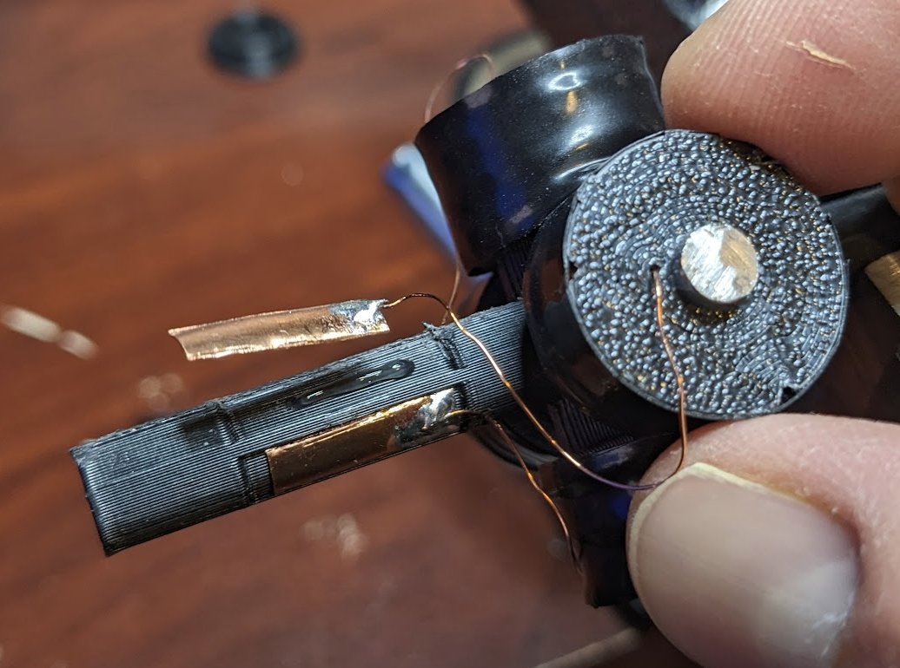

Very important notes:
1. The winding cores must be oriented such that the iron cores are exactly aligned with the gaps between the 
   commutator segments. Think of it this way:  When the iron cores are pointing directly and their stator magnets, 
   the electromagnets need to be in a neutral or unpowered position between one polarity and the other.
2. The commutator segments need to be placed in the correct sequence of recesses that depends on your design: 
   1. __Two-stator two-coil__:  The two commutator segments may be placed in either of the rotor recesses. The only 
      impact of the order is the direction that the motor will rotate when powered. Motor direction is also 
      controlled on the positive and negative power leads, so the commutator placement really does not matter here. 
   2. __Two-stator four-coil__:  Need a figure here.
   3. __Four-coil four-stator__:  Need a figure here.

The final assembled commutators should look as follows:

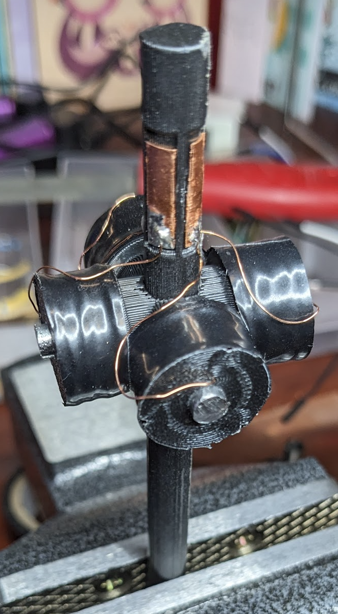

# Build the Power Circuit

Solder the carbon brushes to jumper wires. You'll need a number equal to the number of stator magnets in your design:

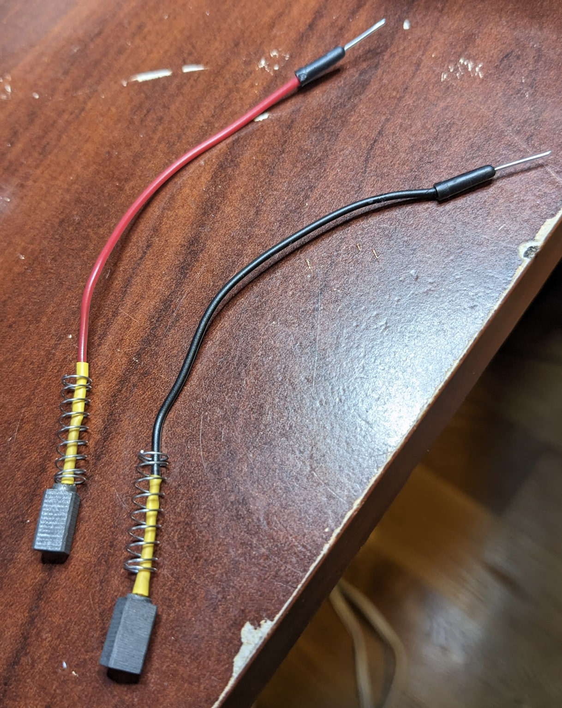

Insert the brush wires into the motor base. The following image shows the brushes in a two-stator design:

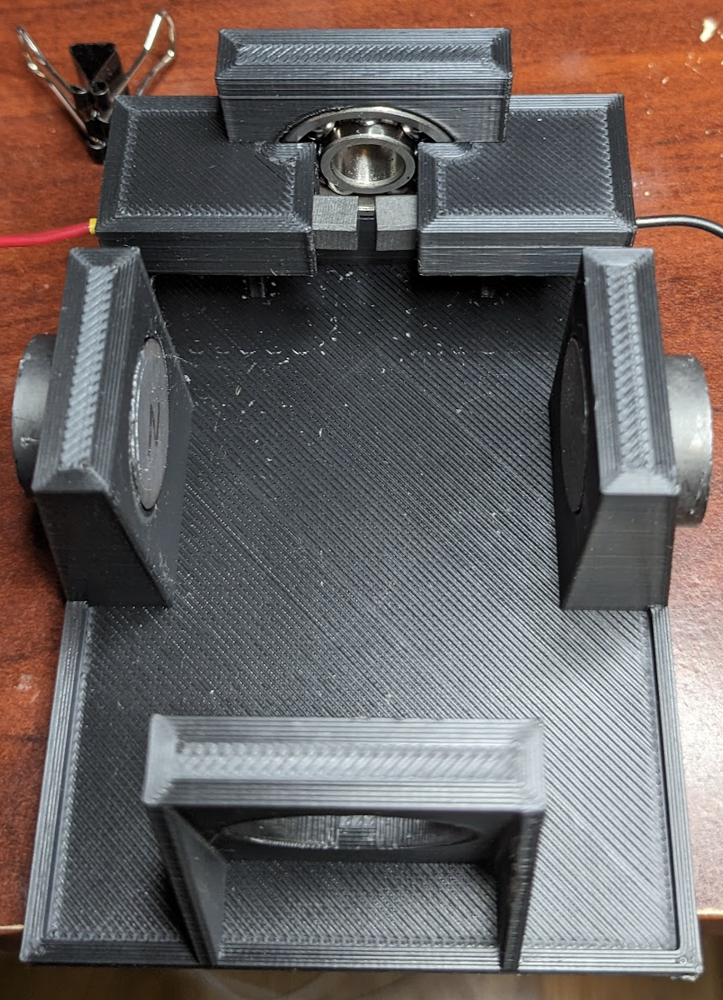

The brushes should move freely when the wires are pulled, with the springs returning them to their extended 
positions. If the brushes catch when pulled or do not spring back, then remove the brushes and file the insides of 
the brush housings. You can wire the DC power source directly to the brush wires, or you can patch it together with a 
breadboard as shown below. The breadboard provides flexibility for building circuitry around the motor (see Other 
Fun Stuff below):

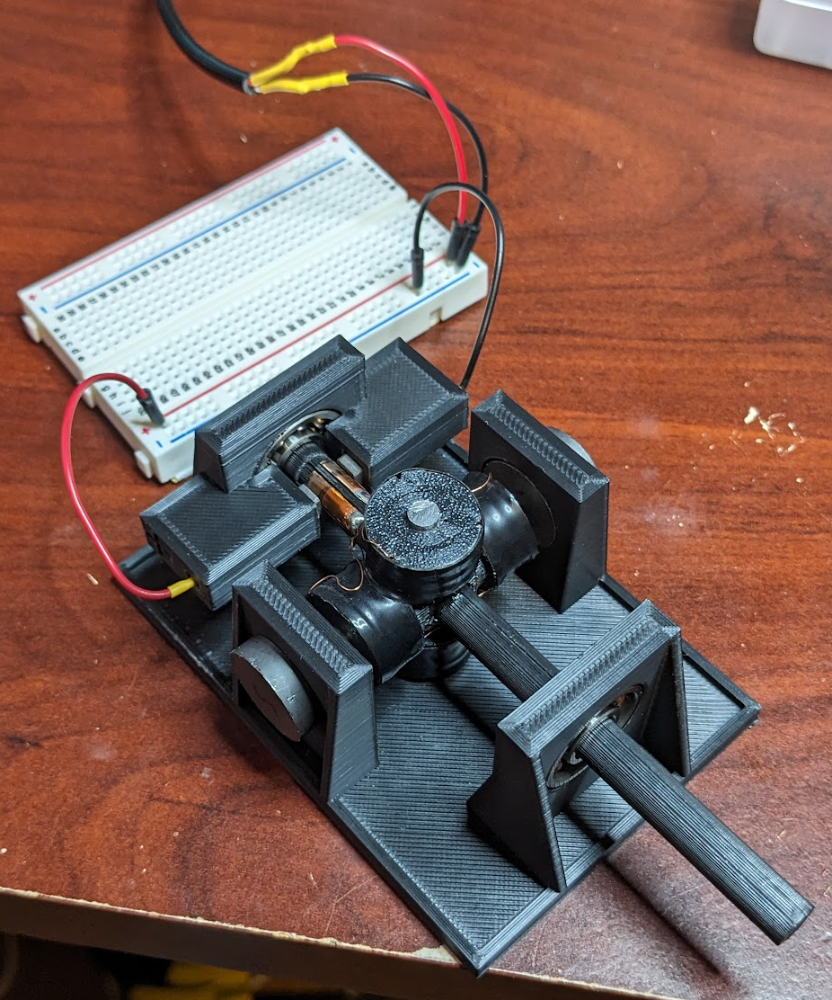

# Install the Stator Magnets

The stator magnets must be arranged such that the internal surfaces -- those facing the coils as they rotate -- 
alternate between north and south. In the two-stator designs, one side should be north and the other south. In the 
four-stator design, the inside-facing stator magnets should alternate north, south, north, and south. Only this 
relative alternation matters. It does not matter which of the two axes holds the north stators and which holds the 
south stators. In all of the photos and videos on this page, there are two disc magnets at each stator location.

Assemble the motor to ensure that it will rotate freely:



# Test and Fix

With a bit of luck, you can power the motor circuit, give the rotor a twist, and it will run:



Common problems:
* Bad power circuit:  You should be able to connect a multimeter to the brush wires that exit the base and measure 
  resistance (ohms) of each coil axis. All axes should be roughly similar (e.g., within 1 ohm) for the 4-coil 
  designs, which have two axes.
* Stuck brushes:  The internal surfaces of the brush houses might be rough. If a rough bit catches a brush as the 
  motor rotates, this might prevent the brush from coming back into contact with the commutator, thus breaking the 
  power circuit. If the brushes do not move smoothly in and out of their houses, then remove them, file the insides 
  of the brush houses, and reassemble.
* Power short:  If the brushes contact multiple commutators simultaneously, the power might short-circuit. The DC 
  power source linked at the top will automatically cut off on shorts. Revisit the commutator assembly if this 
  happens. 
* Weak stator magnets:  The motor base has recesses for single magnets, which might not be strong enough on their 
  own. Adding magnets to the outside increases the field strength substantially. This also conveniently holds the 
  inner magnets in place without adhesive.

# Designs, Videos, and STL Files

The design viewers and STL file downloads are provided below for the three designs.

## Two-Stator Two-Coil ([Download](https://www.thingiverse.com/thing:6153166))

<iframe src="https://gmail3021534.autodesk360.com/shares/public/SH512d4QTec90decfa6efb2dab18e0c3200b?mode=embed" width="800" height="600" allowfullscreen="true" webkitallowfullscreen="true" mozallowfullscreen="true"  frameborder="0"></iframe>

NEED TO ADD VIDEO

## Two-Stator Four-Coil ([Download](https://www.thingiverse.com/thing:6305321))

<iframe src="https://gmail3021534.autodesk360.com/shares/public/SH512d4QTec90decfa6ea160e797dbaa221f?mode=embed" width="800" height="600" allowfullscreen="true" webkitallowfullscreen="true" mozallowfullscreen="true"  frameborder="0"></iframe>



## Four-Stator Four-Coil ([Download](https://www.thingiverse.com/thing:6305329))

<iframe src="https://gmail3021534.autodesk360.com/shares/public/SH512d4QTec90decfa6ee884568e9083a6b5?mode=embed" width="800" height="600" allowfullscreen="true" webkitallowfullscreen="true" mozallowfullscreen="true"  frameborder="0"></iframe>



# Other Fun Stuff:  Tachometer and Web-Controlled Relay

# References

1. [Voltage, Current, and Resistance (a basic overview)](https://learn.sparkfun.com/tutorials/voltage-current-resistance-and-ohms-law/all)
2. [Electromagnets](http://www.coolmagnetman.com/magelect.htm):  In particular, the author's [coildata.xls](../manuals/coildata.xls) spreadsheet is a fantastic way to learn about the ingredients of an electromagnet (coil gauge, winding count, current input, gauss output, etc.)
3. [Brushed DC electric motor (Wikipedia)](https://en.wikipedia.org/wiki/Brushed_DC_electric_motor).

Other parts can be found [here](cad-parts.md).