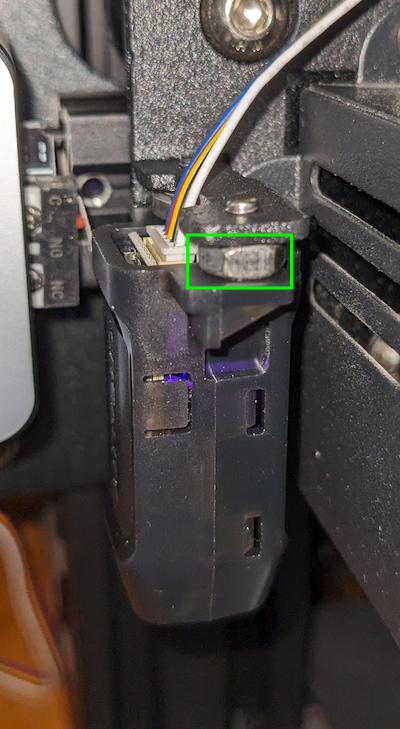
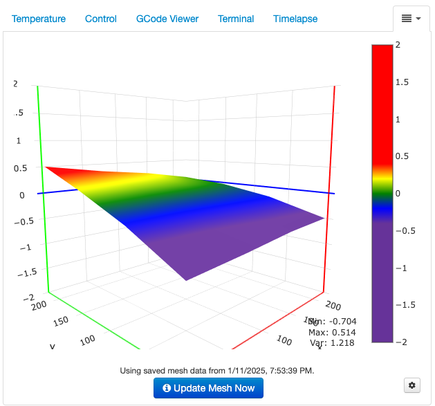

[Home](index.md) > CAD Parts
* Content
{:toc}

This page documents parts I have designed for 3D printing.

# Materials and Tech

* CAD software:  I started out with [FreeCAD](https://www.freecadweb.org/). I was impressed by the range of capabilities 
that comes with the software and the quality with which they are delivered---at least initially. Everything worked well 
for small parts and the initial phases of the larger arm project. However, as the design grew, the tree-structure 
representation of design elements became unwieldy. It was difficult to predict how the tree would rearrange following
an operation. Ultimately, a bug surfaced in the FreeCAD software, and I was unable to undo and recover my design. I 
started looking elsewhere and found [Autodesk Fusion 360](https://www.autodesk.com/products/fusion-360/personal), which 
can be obtained free of charge for personal use. I was, and still am, quite new to CAD; however, Fusion 360 is obviously 
a top-notch product. Everything just works. The operations are stunningly intuitive and well-crafted. It is difficult to 
imagine a reason for looking elsewhere except, of course, for the facts that the free version cannot be used 
commercially and the commercial version is quite expensive.
* Mesh slicer:  [UltiMaker Cura](https://ultimaker.com/software/ultimaker-cura) is a simple tool with a single purpose:
slice the mesh outputs of CAD into horizontal layers that can be 3D printed. The settings are endlessly configurable, 
but the defaults work quite well. Support structures are effective and efficient, and I haven't had a problem yet.
Currently, I'm using [PrusaSlicer]()
* 3D printer:  This is the only item in the list that is not free. With endless options on the market it can be 
difficult to choose; however, at under $200 with generally quite positive reviews, it is difficult to get past the
[Creality Ender-3](https://www.creality.com/products/ender-3-3d-printer). It was simple to assemble and has been 
cranking out high-quality pieces since the start.
* Automatic bed leveling: I added the [CR Touch Automatic Leveling Kit](https://www.amazon.com/Creality-Leveling-Compatible-Mainboard-Printer/dp/B098LQ9WPX/ref=sr_1_3?th=1) 
to my Ender 3. The sensor comes with a mounting bracket for the Ender 3; however, it isn't truly designed for this model,
and I had previously replaced the hot end with something different. As a result, the sensor was mounted too far above
the bed, which caused the hot end to drop down into the bed. After much experimenting and searching, I found that the 
sensor needed to be offset down toward the bed in order for everything to work. I did this by adding spacers as shown
below:
  
  

  After installing the hardware, flash the printer with the correct firmware [here](https://www.creality.com/products/cr-touch-auto-leveling-kit).
Download the firmware bundle prefixed with the printer name (e.g., "Ender-3 CR Touch Firmware" for an Ender 3 printer, or 
"Ender-3 V2 CR Touch Firmware" for an Ender 3 V2 printer). Within the bundle, select the board version. Note that 4.2.2 is 
an early board that requires a special adapter to plug the bed leveling probe into, whereas the 4.2.7 board has a direct 
connection for the probe. Clear an SD card and place the firmware binary onto the card as the only file. Name the file 
"firmware.bin", insert the SD card, and turn the printer off/on. The display should indicate that the firmware has been 
updated. Sometimes this is finicky, and the board doesn't take the firmware. Renaming the file "firmware-123.bin" or 
"Ender 3 firmware.bin" might work. The steps for calibrating the leveling probe's z-offset are as follows:
  1. Auto-home the printer.
  2. Move the z-axis to identify the appropriate z-offset, using a sheet of A4 paper for thickness. Note the z-offset 
     that causes the nozzle to just slightly grab the paper. Call this `adjustment`.
  3. Access the leveling probe's z-offset and note its value. Call this `current`. Then set the leveling probe's 
     z-offset to `current + adjustment`.
  4. Save the configuration settings.
  5. Level the bed. The hot end should be in the correct position above the bed, with the z-value showing 0.0 on the 
  printer display and a very small gap between the nozzle and bed.
  6. Add `G28 G29` to your slicer's g-code preamble. The `G28` (home) command is probably already present, in which case
  you just tack on `G29` (level bed).
  7. Octoprint has a [bed leveling visualizer plugin](https://plugins.octoprint.org/plugins/bedlevelvisualizer), which 
  displays the bed mesh as shown below:
  
  8. Add `G28 G29` to your slicer's g-code preamble. The `G28` (home) command is probably already present, in which case
  you just tack on `G29` (level bed).
* Extrusion stepper calibration:  I kept running into under-extrusion issues. It took a while to realize that new 
  firmware was configured with a lower extrusion rate than the stock Ender 3 firmware. The process for calibrating the
  extrusion rate (or e-steps) is as follows:
  1. Use the menu options to manually extrude 10cm (100mm) of filament. Here, 100mm is `expected mm`.
  2. Measure how many mm of filament is actually extruded, and call this `actual mm`. If `actual mm` equals 
     `expected mm` exactly, then there is no need to calibrate the e-steps. If `actual mm` does not equal `expected mm`, 
     then proceed.
  3. View the extruder's current `steps/mm` value. This is the number of steps that the printer expects it takes to 
     extrude 1mm of filament. Multiply `steps/mm * expected mm` to obtain `steps taken`, the number of steps the 
     extruder actually took to extrude `actual mm`. 
  4. Calculate `steps taken / actual mm` to obtain the calibrated steps/mm value. Enter this into the settings. For
     example:
       1. Under-extrusion:  (81 steps/mm * 100mm expected) / (93mm actual) = 87.097 steps/mm calibrated
       2. Over-extrusion:  (81 steps/mm * 100mm expected) / (117mm actual) = 69.231 steps/mm calibrated
  5. Python function to obtain the calibrated steps/mm:
     ```python
     def calibrate(
         expected_mm: float, 
         actual_mm: float, 
         steps_per_mm: float
     ) -> float: 
         return (steps_per_mm * expected_mm) / actual_mm
     ```
* Bed update with direct-drive extrusion:  In the end, the automatic bed leveling update did not work very well. Some 
  prints did okay, but others had issues when printing over the entire print bed. I ended up reverting back to the stock 
  Ender 3 firmware as follows:
  1. Visit the Creality Cloud [firmware site](https://www.crealitycloud.com/downloads/firmware/ender-series/ender-3)
  2. Download `Ender-3Marlin2.0.6HW4.2.2 GD Version firmware`, as my Ender 3 has the 4.2.2 mainboard with the GD chip.
  3. After flashing the firmware, the default language is Chinese. The language menu is second from bottom in the main
     interface.
  4. Recalibrate the extrusion stepper motor (see above).
  I updated to [a glass bed](https://www.amazon.com/Creality-Ender-Glass-Upgraded-235x235x4mm/dp/B07RD6D2ZQ/), which is
  very flat, and also to [a direct-drive](https://www.amazon.com/dp/B09KG8MMQ2) adapter for the extrusion motor. This
  has been working well. 
* 3D printer web interface:  I use [OctoPrint](https://octoprint.org) with my Raspberry Pi as an efficient and easy way
to manage print jobs. See [here](octoprint.md) for tips on configuring OctoPrint on the Pi.
* Tips for changing the bowden tube and nozzle, particularly when the extruder stepper motor is skipping, the extruder 
  gear is slipping on the filament, or the printer is under-extruding.
  1. Remove the nozzle:  The flat end should be clean without any filament sitting on top, which might indicate that the 
     bowden tube isn't tightly seated against the nozzle entry within the hot end.
  2. Replace the bowden tube.
     1. Replace the tube couplings in the extruder and hot end to ensure they will properly grab the new tube. 
     2. Tighten the nozzle.
     3. Loosen the nozzle 3/4 a turn.
     4. Insert the bowden tube firmly and fully into the hot end coupling.
     5. Heat the hot end.
     6. Tighten the nozzle, which seats the bowden tube firmly against the nozzle.
     7. Trim the tube to length for the extruder so that it can easily reach all print positions.
     8. Insert the bowden tube firmly and fully into the extruder coupling.
     9. Level the bed if needed.

# Robotic Arm

<iframe src="https://gmail3021534.autodesk360.com/shares/public/SH35dfcQT936092f0e4344f64dd3dcf58a6f?mode=embed" width="800" height="600" allowfullscreen="true" webkitallowfullscreen="true" mozallowfullscreen="true"  frameborder="0"></iframe>

This was the first real project that I pursued with 3D printing. The concept is basic, including five degrees of 
freedom driven by [SG90 servo motors](https://www.amazon.com/dp/B08KY49SFX). The design poses several good challenges 
for anyone starting out with CAD or---like me---returning to CAD after a _very_ long time (9th grade high school, if my 
memory serves):

* Mobility:  A little practice goes a long way toward designing solid objects from 2D sketches (points, lines, circles, 
planes, etc.) and 3D operations (extrusions, joins, cuts, holes, etc.). I found the learning curve to be quite gentle in 
this regard, particularly with the right CAD system (more on this later). It was much more difficult to build 
constrained movement into the design. Think hinges and keyed rotation shafts. These were tricky at first, but effective 
patterns became evident after a few attempts.
* Motor-part integration:  This is where the magic happens, where the design comes to life. In the case of the robotic
arm it was a matter of connecting the rotating shaft of the SG90 servo with a mobile part of the arm design.
* Build tolerance:  Mobility requires parts to be in contact but not be too tight. CAD provides exact precision, and 
although entry-level 3D printers provide surprising fidelity, they are not exact. However, the inexactness is systematic 
in my experience, and small tolerances seem to be quite achievable.

All of this adds up to a good bit of time, failure, iteration, and fun. Full details can be found 
[here](robotic-arm.md).

Related projects:

* [Smart car](smart-car.md)

# Freenove Smart Car Rear- and Front-Mounts

The smart car comes out of the box with a front-mounted camera. I designed this bracket to move the camera to the back
and provide room for front-mounted parts like the robotic arm described above.

<iframe src="https://gmail3021534.autodesk360.com/shares/public/SH35dfcQT936092f0e43a682340dfc199b2c?mode=embed" width="800" height="600" allowfullscreen="true" webkitallowfullscreen="true" mozallowfullscreen="true"  frameborder="0"></iframe>

The files for this design can be downloaded from Thingiverse [here](https://www.thingiverse.com/thing:6153142).

Related projects:

* [Smart car](smart-car.md)

# Elevator

This is an elevator designed for the stepper motors found 
[here](https://www.digikey.com/en/products/detail/adafruit-industries-llc/858/5629414).

<iframe src="https://gmail3021534.autodesk360.com/shares/public/SH35dfcQT936092f0e43161fdf97e4f7a1b0?mode=embed" width="800" height="600" allowfullscreen="true" webkitallowfullscreen="true" mozallowfullscreen="true"  frameborder="0"></iframe>

Full details can be found [here](elevator.md).

Related projects:

* [Smart car](smart-car.md)

# DC Motors

The following is a four-coil brushed direct-current (DC) motor:

<iframe src="https://gmail3021534.autodesk360.com/shares/public/SH512d4QTec90decfa6ee884568e9083a6b5?mode=embed" width="800" height="600" allowfullscreen="true" webkitallowfullscreen="true" mozallowfullscreen="true"  frameborder="0"></iframe>

Full details can be found [here](brushed-dc-motor.md).


# Tips and Tricks

1. The small deboss labels on various components contain the Fusion 360 version numbers of the design file. This is a 
handy way to keep track of the design file version used to print each component, particularly when diagnosing issues, 
updating the design, and printing new versions. I use the 
[ParametricText](https://parametrictext.readthedocs.io/en/stable/) add-in to automatically update the version numbers 
when saving the design file.