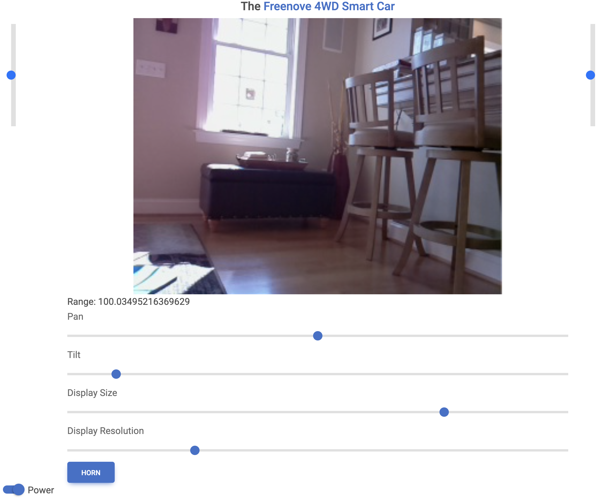

Home
* Content
{:toc}

# Features

## Python Interface for GPIO Circuits
This package provides two related capabilities. [First](python-gpio.md), it provides a high-level, 
event-driven Python interface for GPIO circuits running on the Raspberry Pi. Sensors, motors, LEDs, switches, and many 
other components are covered.



## Remote Control of GPIO Circuits via REST/HTML/JavaScript
[Second](remote-gpio.md), this package enables remote control of GPIO circuits via REST APIs 
invoked from HTML/JavaScript front-ends. Want to control your circuit remotely from your phone? Look no further. This 
package auto-generates HTML/JavaScript for GPIO circuits based on 
[Material Design for Bootstrap](https://mdbootstrap.com). These HTML/JavaScript elements can be embedded in full web 
pages for remote control of the circuit. The remote control screen for the 
[Freenove Smart Car](smart-car.md) is shown below:



As another example, consider 
[the 3D-printed robotic arm](https://matthewgerber.github.io/raspberry-py/smart-car.html#advanced-robotic-arm) that I 
designed for the car:

<iframe src="https://gmail3021534.autodesk360.com/shares/public/SH35dfcQT936092f0e4344f64dd3dcf58a6f?mode=embed" width="800" height="600" allowfullscreen="true" webkitallowfullscreen="true" mozallowfullscreen="true"  frameborder="0"></iframe>

# Using and Developing `raspberry-py` 
The `raspberry-py` package can be consumed in two ways:

1. Add `raspberry-py` to a project as a PyPI dependency. This is the best approach if you only want to use the 
functionality provided by `raspberry-py`. The `raspberry-py` package is available 
[here](https://pypi.org/project/raspberry-py/), and an example of adding the package dependency is provided
[here](https://github.com/MatthewGerber/raspberry-py-dependency-example).
2. [Fork](https://github.com/MatthewGerber/raspberry-py/fork) the present repository and then install it locally. This 
is the best approach if you want to enhance and/or fix the functionality provided by `raspberry-py`. In the following, 
`XXXX` is the user account into which the repository is forked:
```shell
git clone git@github.com:XXXX/raspberry-py.git
cd raspberry-py
virtualenv -p python3.9 venv
. venv/bin/activate
pip install -U pip
pip install -e .
```
From here, you can push back to your fork and submit a pull request to the original if desired.

# Operating System Configuration

## Ubuntu
The `raspberry-py` package should be compatible with the standard 
[Raspberry Pi OS](https://www.raspberrypi.com/software/); however, I have been using the Ubuntu installation described 
[here](https://matthewgerber.github.io/rlai/raspberry_pi.html#operating-system) (ignore the "Install RLAI" section).

## GPIO
By default, Ubuntu does not give the user permission to interact with the GPIO pins of the Raspberry Pi. To grant GPIO 
permissions when the Raspberry Pi boots:
1. Edit `/etc/udev/rules.d/99-gpiomem.rules` as follows to assign all `gpio*` device to the `dialout` group, which the 
user is a member of by default:
```
KERNEL=="gpio*", OWNER="root", GROUP="dialout"
```
2. Reboot for the new permissions to take effect.

Use of I2C with the Raspberry Pi (e.g., page 111 of [the tutorial](../manuals/freenove-tutorial.pdf)) requires 
configuration with the `raspi-config` utility, which is installed by default in the Raspberry Pi OS but not in Ubuntu. 
Install `raspi-config` for Ubuntu with the following commands:
```
sudo apt install lua5.1
wget http://archive.raspberrypi.org/debian/pool/main/r/raspi-config/raspi-config_20211019_all.deb
sudo dpkg -i raspi-config_20211019_all.deb
```
A full listing of the latest `raspi-config` packages can be found 
[here](http://archive.raspberrypi.org/debian/pool/main/r/raspi-config). The user will also need to be added to the 
`i2c` group with `sudo usermod -a -G i2c ubuntu` (then restart for the change to take effect).

Enabling and testing the Raspberry Pi video camera:
1. Modify boot config:  `sudo emacs /boot/firmware/config.txt` and add `start_x=1` and `gpu_mem=256` at the end.
2. Enable camera:  `sudo apt install raspi-config`, then `raspi-config`, then enable the camera.
3. Give permission:  `sudo usermod -a -G video ubuntu`
4. Restart:  `sudo shutdown -r now`
5. Test:  `raspistill -o test.jpg`

## `mjpg_streamer`
The `mjpg_streamer` utility is an efficient way to stream video from various input devices (e.g., Raspberry Pi camera 
module or USB webcam) to various output devices (e.g., web browser). Install as follows:
```shell
sudo apt install subversion libjpeg-turbo8-dev imagemagick ffmpeg libv4l-dev cmake libgphoto2-dev libopencv-dev libsdl-dev libprotobuf-c-dev v4l-utils
git clone https://github.com/jacksonliam/mjpg-streamer.git
cd mjpg-streamer/mjpg-streamer-experimental/
export LD_LIBRARY_PATH=.
make
```
List connected video devices:
```
v4l2-ctl --list-devices

mmal service 16.1 (platform:bcm2835-v4l2):
	/dev/video2

WEB CAM: WEB CAM (usb-0000:01:00.0-1.1):
	/dev/video0
	/dev/video1
	/dev/media0
```
The first (connected to `/dev/video2`) is 
[a Raspberry Pi camera module](https://www.raspberrypi.com/products/camera-module-v2/). The second (connected to 
`/dev/video0`) is [a USB webcam](https://www.amazon.com/dp/B087M3BVP9).

To stream the Raspberry Pi camera module:
```
./mjpg_streamer -i "input_uvc.so -d /dev/video2 -fps 15" -o "output_http.so -p 8081 -w ./www"
```
Alternatively, to stream the USB webcam:
```
./mjpg_streamer -i "input_uvc.so -d /dev/video0 -fps 15" -o "./output_http.so -p 8081 -w ./www"
```
In both of the above:
* `-d /dev/video*` selects the video input device.
* `-f 15` runs the camera at 15 frames per second.
* `-p 8081` serves the MJPG stream on port 8081 of all IP interfaces.
* `-w ./www` points the streamer at the `www` directory.

Once the streamer is up and running, navigate to `http://xxxx:8081/` for an overview or 
`http://xxxx:8081/?action=stream` for a dedicated stream (where `xxxx` is the IP address of the Raspberry Pi). 

It can happen that a process is holding a `/dev/video*` device, which prevents your camera from connecting. List video
devices:
```
sudo fuser /dev/video*
/dev/video0:          1418m
```
Dig a bit more:
```
ps aux | grep 1418
root        1418  0.0  0.8 304784 65344 ?        Sl   20:36   0:02 ...
```
Then kill the process if you wish:
```
sudo kill 1418
```

References:
* [Setting up OctoPrint on a Raspberry Pi running Raspberry Pi OS (Debian)](https://community.octoprint.org/t/setting-up-octoprint-on-a-raspberry-pi-running-raspberry-pi-os-debian/2337#optional-webcam-9)