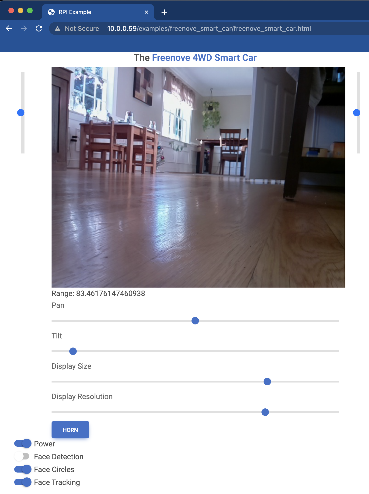

# raspberry-py
This package provides two related capabilities. [First](raspberry-py/python-gpio.md), it provides a high-level, 
event-driven Python interface for GPIO circuits running on the Raspberry Pi. Sensors, motors, LEDs, switches, and many 
other components are covered.



[Second](raspberry-py/remote-gpio.md), this package enables remote control of GPIO circuits via REST APIs 
invoked from HTML/JavaScript front-ends. Want to control your circuit remotely from your phone? Look no further. This 
package auto-generates HTML/JavaScript for GPIO circuits based on 
[Material Design for Bootstrap](https://mdbootstrap.com). These HTML/JavaScript elements can be embedded in full web 
pages for remote control of the ciruit. The remote control screen for the 
[Freenove Smart Car](https://matthewgerber.github.io/raspberry-py/raspberry-py/smart-car.html) is shown below:



Follow the links above (or below) for details:
1. [Python interface for GPIO circuits](raspberry-py/python-gpio.md)
2. [Remote control of GPIO circuits via REST/HTML/JavaScript](raspberry-py/remote-gpio.md)

# Installation
Create a new Python virtual environment and install `raspberry-py`:
```
cd /path/to/raspberry-py/repo
virtualenv -p python3.9 venv
. venv/bin/activate
pip install -U pip
pip install -e .
```

# Ubuntu for Raspberry Pi with GPIO Configuration
This package has been developed using the Ubuntu installation described 
[here](https://matthewgerber.github.io/rlai/raspberry_pi.html#operating-system) (ignore the "Install RLAI" section). By 
default, Ubuntu does not give the user permission to interact with the GPIO pins of the Raspberry Pi. To grant GPIO 
permissions when the Raspberry Pi boots:
1. Edit `/etc/udev/rules.d/99-gpiomem.rules` as follows to assign all `gpio*` device to the `dialout` group, which the 
user is a member of by default:
```
KERNEL=="gpio*", OWNER="root", GROUP="dialout"
```
2. Reboot for the new permissions to take effect.

Use of I2C with the Raspberry Pi (e.g., page 111 of [the tutorial](freenove-tutorial.pdf)) requires configuration 
with the `raspi-config` utility, which is installed by default in the Raspberry Pi OS but not in Ubuntu. 
Install `raspi-config` for Ubuntu with the following commands:
```
sudo apt install lua5.1
wget http://archive.raspberrypi.org/debian/pool/main/r/raspi-config/raspi-config_20211019_all.deb
sudo dpkg -i raspi-config_20211019_all.deb
```
A full listing of the latest `raspi-config` packages can be found 
[here](http://archive.raspberrypi.org/debian/pool/main/r/raspi-config). The user will also need to be added to the 
`i2c` group with `sudo usermod -a -G i2c ubuntu` (then restart for the change to take effect).

Enabling and testing the Raspberry Pi video camera:
1. Modify boot config:  `sudo emacs /boot/firmware/config.txt` and add `start_x=1` and `gpu_mem=256` at the end.
2. Enable camera:  `sudo apt install raspi-config`, then `raspi-config`, then enable the camera.
3. Give permission:  `sudo usermod -a -G video ubuntu`
4. Restart:  `sudo shutdown -r now`
5. Test:  `raspistill -o test.jpg`
