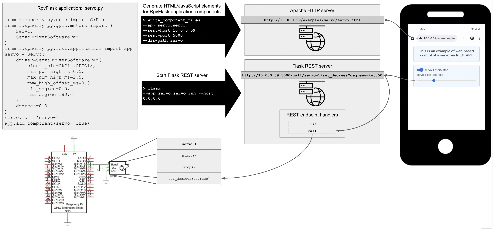

[Home](index.md) > Remote Control of GPIO Circuits via REST/HTML/JavaScript
* Content
{:toc}

# Introduction
Remote control of GPIO circuits is achieved by integrating three components:
* RpyFlask application:  Instantiates the GPIO circuit components using the Python types described 
  [here](python-gpio.md).
* Apache HTTP server:  Serves web pages for the RpyFlask application, to be accessed from remote devices like a phone.
* Flask REST server:  Serves REST endpoints that web page elements (e.g., toggles and sliders) can invoke to control
the GPIO circuit (e.g., turning a servo motor on/off and setting its angular position).

These components are depicted graphically below and described in more detail in the following sections.



A key feature of the present package is that, once the GPIO circuit is built (bottom left of the figure) and the 
RpyFlask application is written (top left of the figure), generating the HTML/JavaScript elements and the REST endpoints
is almost fully automated.

# RpyFlask Application
The RpyFlask application is a central element of the architecture presented above. Internally, the RpyFlask application
has the following responsibilities:
* Keep track of circuit components like the servo.
* Specify how circuit components are rendered into HTML controls.
* Handle calls to the REST endpoints. 
* Specify how the HTML controls connect to the circuit components via the REST endpoints. 

These are general responsibilities that apply to all GPIO circuits. As such, they are almost completely hidden from the 
developer, who only writes the code in the top left of the figure above. This code is reproduced below and found 
[here](https://github.com/MatthewGerber/raspberry-py/blob/main/src/raspberry_py/rest/examples/servo/servo.py):
```
from raspberry_py.gpio import CkPin
from raspberry_py.gpio.motors import Servo, ServoDriverSoftwarePWM
from raspberry_py.rest.application import app

servo = Servo(
    driver=ServoDriverSoftwarePWM(
        signal_pin=CkPin.GPIO18,
        min_pwm_high_ms=0.5,
        max_pwm_high_ms=2.5,
        pwm_high_offset_ms=0.0,
        min_degree=0.0,
        max_degree=180.0
    ),
    degrees=0.0
)
servo.id = 'servo-1'

app.add_component(servo, True)
```
This code specifies an RpyFlask application containing a servo. It is the basis for HTML/JavaScript and REST API 
generation, which are explained below.

# Apache HTTP Server
This example uses Apache, which can be installed with `sudo apt install apache2`. An example Apache site configuration 
file can be found [here](rpy-rest.conf), though beware of security vulnerabilities like lack of HTTPS and potential 
exposure of files. Following initial Apache installation, edit the `rpy-rest.conf` file so that the relevant paths match 
your local file system. Then proceed as follows to install and enable the site:
   ```shell
   sudo cp /path/to/rpy-rest.conf /etc/apache2/sites-available
   sudo a2ensite rpy-rest.conf
   ```
Edit `/etc/apache2/ports.conf` to include 8080, and set permissions on your home directory with `chmod 755 /home/dir` so 
that Apache can read the files. Then restart the server:
```
sudo systemctl reload apache2
```
Once the Apache HTTP server is configured, it's time to generate HTML/JavaScript controls for the RpyFlask application 
shown above. Consider the following command, which is listed in the top black arrow in the above figure:
```shell
cd /path/to/raspberry-py/src/raspberry_py/rest/examples
write_component_files --app servo.servo --rest-host 10.0.0.59 --rest-port 5000 --dir-path servo
```
The arguments are as follows:
* `--app`:  Where to look for the RpyFlask application. The command scans `servo.servo` for an `app` variable, which is 
the RpyFlask application described above. This may be relative to the package in the current working directory as here, 
or it may be the fully-qualified module name.
* `--rest-host` and `--rest-port`:  The location of the REST server to contact when the user interacts with the 
HTML/JavaScript controls. This would normally be the IP address of the Raspberry Pi that is controlling the circuit.
* `--dir-path`:  Directory in which to write the resulting HTML/JavaScript files. This will be created if it does not 
already exist.

The command generates HTML/JavaScript controls for each of the circuit components in the RpyFlask application. A single 
circuit component may produce multiple such files, and in the case of our servo example there are
[two](https://github.com/MatthewGerber/raspberry-py/tree/main/src/raspberry_py/rest/examples/servo):
* `servo-1-start-stop.html`:  An on/off toggle for starting and stopping the servo.
* `servo-1-set_degrees.html`:  A slider for setting the servo's angular position.

The command also generates the supporting files `globals.js` (global variables like the REST host and port to contact)
and `utils.js` (utility functions) that are used by the JavaScript controls. Consider `servo-1-start-stop.html` in  full
detail:
```html
<div class="form-check form-switch">
  <label class="form-check-label" for="servo-1-start-stop">servo-1 start/stop</label>
  <input class="form-check-input" type="checkbox" role="switch" id="servo-1-start-stop"/>
</div>
<script type="module">
import {rest_host, rest_port} from "./globals.js";
const servo_1_start_stop = $("#servo-1-start-stop");
servo_1_start_stop.on("change", function () {
  $.ajax({
    url: servo_1_start_stop.is(":checked") ? "http://" + rest_host + ":" + rest_port + "/call/servo-1/start" : "http://" + rest_host + ":" + rest_port + "/call/servo-1/stop",
    type: "GET"
  });
});
</script>
```
The general pattern for the HTML/JavaScript files is to specify an HTML control followed by JavaScript that connects the 
control with the circuit component running in the RpyFlask application. Here we have a labeled toggle switch, and the
JavaScript calls either the `servo-1/start` or `servo-1/stop` REST endpoints depending on the status of the switch. 
These HTML/JavaScript files can then be embedded within a full HTML page such as 
[this](https://github.com/MatthewGerber/raspberry-py/blob/main/src/raspberry_py/rest/examples/servo/servo.html), which 
is rendered in a browser as shown below:


# Flask REST Server
As with the Apache HTTP server, any modern HTTP server should suffice for serving the REST endpoints that are contacted 
by the JavaScript described above. For simplicity, we use Flask's built-in server, which is started as follows:
```shell
flask --app servo.servo run --host 0.0.0.0
```
The arguments are as follows:
* `--app`:  Where to look for the RpyFlask application. This works similarly to the `--app` argument in the previous 
command. The sub-command `run` instructs Flask to run the server.
* `--host`:  Specifies the IP address on which the Flask REST server should listen for incoming client connections. The
special value of `0.0.0.0` causes Flask to listen on all the machine's IP addresses. The default port is 5000, which
can be modified but must match the `--rest-port` used earlier. See the Flask 
[site](https://flask.palletsprojects.com/) for more information.

The output of starting the Flask server should resemble the following:
```shell
 * Serving Flask app 'servo.servo'
 * Debug mode: off
WARNING: This is a development server. Do not use it in a production deployment. Use a production WSGI server instead.
 * Running on all addresses (0.0.0.0)
 * Running on http://127.0.0.1:5000
 * Running on http://10.0.0.59:5000
Press CTRL+C to quit
```
You should now be able to visit `http://10.0.0.59/examples/servo/servo.html` from any web browser that has access to the
host IP address. The page should appear as shown above, and interacting with the controls should cause the Flask server 
to emit messages such as the following (e.g., for the servo's power switch and slider):
```shell
10.0.0.246 - - [02/Dec/2022 22:51:26] "GET /call/servo-1/start HTTP/1.1" 200 -
INFO:werkzeug:10.0.0.246 - - [02/Dec/2022 22:51:26] "GET /call/servo-1/start HTTP/1.1" 200 -
10.0.0.246 - - [02/Dec/2022 22:51:27] "GET /call/servo-1/set_degrees?degrees=int:1 HTTP/1.1" 200 -
INFO:werkzeug:10.0.0.246 - - [02/Dec/2022 22:51:27] "GET /call/servo-1/set_degrees?degrees=int:1 HTTP/1.1" 200 -
10.0.0.246 - - [02/Dec/2022 22:51:27] "GET /call/servo-1/set_degrees?degrees=int:2 HTTP/1.1" 200 -
INFO:werkzeug:10.0.0.246 - - [02/Dec/2022 22:51:27] "GET /call/servo-1/set_degrees?degrees=int:2 HTTP/1.1" 200 -
10.0.0.246 - - [02/Dec/2022 22:51:27] "GET /call/servo-1/set_degrees?degrees=int:3 HTTP/1.1" 200 -
INFO:werkzeug:10.0.0.246 - - [02/Dec/2022 22:51:27] "GET /call/servo-1/set_degrees?degrees=int:3 HTTP/1.1" 200 -
10.0.0.246 - - [02/Dec/2022 22:51:27] "GET /call/servo-1/set_degrees?degrees=int:4 HTTP/1.1" 200 -
INFO:werkzeug:10.0.0.246 - - [02/Dec/2022 22:51:27] "GET /call/servo-1/set_degrees?degrees=int:4 HTTP/1.1" 200 -
10.0.0.246 - - [02/Dec/2022 22:51:27] "GET /call/servo-1/set_degrees?degrees=int:5 HTTP/1.1" 200 -
INFO:werkzeug:10.0.0.246 - - [02/Dec/2022 22:51:27] "GET /call/servo-1/set_degrees?degrees=int:5 HTTP/1.1" 200 -
```
If the circuit is properly built and powered on, the servo will activate and move accordingly. MacOS runs AirPlay 
Receiver on port 5000. If you get unexpected errors when making REST calls to Flask, try disabling AirPlay Receiver at 
System Preferences => Sharing => AirPlay Receiver.

# Example:  Freenove 4WD Smart Car
The [Freenove 4WD Smart Car](https://www.amazon.com/Freenove-Raspberry-Tracking-Avoidance-Ultrasonic/dp/B07YD2LT9D) 
comes with Python software, including a remote control interface. I have reimplemented most of the capabilities using 
the present Python package. The following is a screenshot of the control screen for the car based on the above 
framework (read more [here](smart-car.md)):


