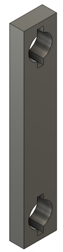

[Home](index.md) > [CAD Parts](cad-parts.md) > Robotic Arm
* Content
{:toc}

<iframe src="https://gmail3021534.autodesk360.com/shares/public/SH35dfcQT936092f0e4344f64dd3dcf58a6f?mode=embed" width="800" height="600" allowfullscreen="true" webkitallowfullscreen="true" mozallowfullscreen="true"  frameborder="0"></iframe>

# Introduction

This page documents the development of a 3D-printed robotic arm for use with the remote-controlled 
[Freenove Smart Car](smart-car.md). The current design has five degrees of freedom listed below.

1. Base rotation
2. Arm elevation
3. Wrist elevation 
4. Wrist rotation
5. Pinch

Due to the symmetry of the design, DoFs 1 and 2 comprise the same parts as 3 and 4. These two pairs provide rotation and 
elevation at each end of the arm, leaving the pincher to sit on top. 

# Parts:  Print Times/Costs and Images 

The table below shows the arm parts with estimated print times and materials from the Cura slicer and costs based on $20 
per 1000 grams ($0.02 per gram) of filament
(e.g., [here](https://www.amazon.com/Polymaker-PolyTerra-Bioplastic-Printing-Filament/dp/B08QN5FQX7/)).

| Part                           | Print Time (HH:MM) | Print Cost  | Image                                          |
|--------------------------------|--------------------|-------------|------------------------------------------------|
| Base rotator                   | 3:45               | $0.48 (24g) |          |
| Arm base                       | 1:45               | $0.20 (10g) |             |
| Arm elevator wheel             | 0:30               | $0.04 (2g)  |               |
| Arm                            | 0:30               | $0.06 (3g)  |                       |
| Wrist elevator wheel           | 0:30               | $0.04 (2g)  |             | 
| Wrist base                     | 1:45               | $0.20 (10g) |           |
| Wrist rotator                  | 3:45               | $0.48 (24g) |         | 
| Pincher base with fixed finger | 2:30               | $0.30 (15g) |     |
| Pincher mobile finger          | 0:40               | $0.08 (4g)  |  |
| Pincher pin                    | 0:10               | $0.02 (1g)  |       | 
| Total                          | 15:50              | $1.90 (95g) |   |                 

The complete design image does not show the base rotator, arm base, and arm elevator wheel. The design is symmetric on
each end of the arm, so it was not necessary to draw these components. The files for
this design can be downloaded [here](https://www.printables.com/model/1390338-5-dof-robotic-arm).

Other parts can be found [here](cad-parts.md).
