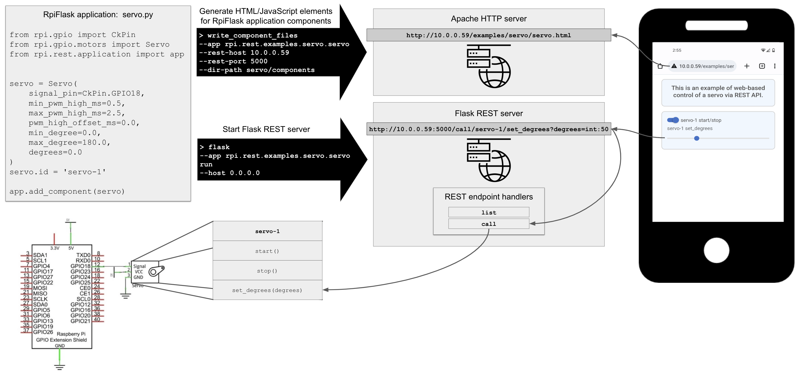
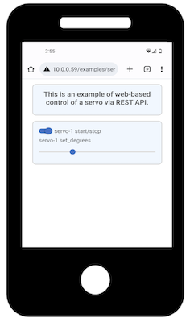

[Home](../index.md) > Remote GPIO

# Remote Control of GPIO Circuits via REST/HTML/JavaScript
Remote control of GPIO circuits is achieved by integrating three components:
* RpiFlask application:  Instantiates the GPIO circuit components using the Python types described 
  [here](python-gpio.md).
* Apache HTTP server:  Serves web pages for the RpiFlask application, to be accessed from remote devices like a phone.
* Flask REST server:  Serves REST endpoints that web page elements (e.g., toggles and sliders) can invoke to control
the GPIO circuit (e.g., turning a servo motor on/off and setting its angular position).

These components are depicted graphically below and described in more detail in the following sections.



A key feature of the present package is that, once the GPIO circuit is built (bottom left of the figure) and the 
RpiFlask application is written (top left of the figure), generating the HTML/JavaScript elements and the REST endpoints
is almost fully automated.

## RpiFlask Application
The RpiFlask application is a central element of the architecture presented above. Internally, the RpiFlask application
has the following responsibilities:
* Keep track of circuit components like the servo.
* Specify how circuit components are rendered into HTML controls.
* Handle calls to the REST endpoints. 
* Specify how the HTML controls connect to the circuit components via the REST endpoints. 

These are general responsibilities that apply to all GPIO circuits. As such, they are almost completely hidden from the 
developer, who only writes the code in the top left of the figure above. This code is reproduced below and found 
[here](https://github.com/MatthewGerber/rpi/blob/main/src/rpi/rest/examples/servo/servo.py):
```
from rpi.gpio import CkPin
from rpi.gpio.motors import Servo
from rpi.rest.application import app


servo = Servo(
    signal_pin=CkPin.GPIO18,
    min_pwm_high_ms=0.5,
    max_pwm_high_ms=2.5,
    pwm_high_offset_ms=0.0,
    min_degree=0.0,
    max_degree=180.0,
    degrees=0.0
)
servo.id = 'servo-1'

app.add_component(servo)
```
This code specifies an RpiFlask application containing a servo. It is the basis for HTML/JavaScript and REST API 
generation, which are explained below.

## Apache HTTP Server
This example uses Apache, which is simple to configure on Ubuntu for RPI (see [here](../index.md) for Ubuntu 
installation on RPI). Any modern HTTP server should suffice.
[Install and configure](https://ubuntu.com/tutorials/install-and-configure-apache#1-overview) an Apache HTTP server. 
An example site configuration file can be found [here](rpi-rest.conf), though beware of security vulerabilities like 
lack of HTTPS and potential exposure of files.

Once the Apache HTTP server is configured, it's time to generate HTML/JavaScript controls for the RpiFlask application 
shown above. Consider the following command, which is listed in the top black arrow in the above figure:
```shell
write_component_files --app rpi.rest.examples.servo.servo --rest-host 10.0.0.59 --rest-port 5000 --dir-path servo/components
```
The arguments are as follows:
* `--app`:  Where to look for the RpiFlask application. The command scans `rpi.rest.examples.servo.servo` for an `app`
variable, which is the RpiFlask application described above. This may be the fully-qualified module name as here, or it
may be relative to the package in the current working directory. For example, it could be shortened to `servo.servo` if
the current working directory were `~/rpi/src/rpi/rest/examples`.
* `--rest-host` and `--rest-port`:  The location of the REST server to contact when the user interacts with the 
HTML/JavaScript controls. 
* `--dir-path`:  Directory in which to write the resulting HTML/JavaScript files. This will be created if it does not 
already exist.

The command generates HTML/JavaScript controls for each of the circuit components in the RpiFlask application. A single 
circuit component may produce multiple such files, and in the case of our servo example there are
[two](https://github.com/MatthewGerber/rpi/tree/main/src/rpi/rest/examples/servo/components):
* `servo-1-start-stop.html`:  An on/off toggle for starting and stopping the servo.
* `servo-1-set_degrees.html`:  A slider for setting the servo's angle.

Consider the first of these in detail:
```html
<div class="form-check form-switch">
  <label class="form-check-label" for="servo-1-start-stop">servo-1 start/stop</label>
  <input class="form-check-input" type="checkbox" role="switch" id="servo-1-start-stop" />
</div>
<script>
$("#servo-1-start-stop").on("change", function () {
  $.ajax({
    url: $("#servo-1-start-stop").is(":checked") ? "http://10.0.0.59:5000/call/servo-1/start" : "http://10.0.0.59:5000/call/servo-1/stop",
    type: "GET"
  });
});
</script>
```
The general pattern for the HTML/JavaScript files is to specify an HTML control followed by JavaScript that connects the 
control with the circuit component running in the RpiFlask application. Here we have a labeled toggle switch, and the
JavaScript calls either the `servo-1/start` or `servo-1/stop` REST endpoints depending on the status of the switch. The 
HTML/JavaScript files can then be embedded within a full HTML page such as 
[this](https://github.com/MatthewGerber/rpi/blob/main/src/rpi/rest/examples/servo/servo.html), which is rendered in a 
browser as shown below:



## Flask REST Server
As with the Apache HTTP server, any modern HTTP server should suffice for serving the REST endpoints that are contacted 
by the JavaScript described above. For simplicity, we use Flask's built-in server, which is started as follows:
```
flask --app rpi.rest.examples.servo.servo run --host 0.0.0.0
```
The arguments are as follows:
* `--app`:  Where to look for the RpiFlask application. This works similarly to the `--app` argument in the previous 
command. The sub-command `run` instructs Flask to run the server.
* `--host`:  Specifies the IP address on which the Flask REST server should listen for incoming client connections. The
special value of `0.0.0.0` causes Flask to listen on all the machine's IP addresses. The default port is 5000, which
can be modified but must match the `--rest-port` used earlier. See the Flask 
[site](https://flask.palletsprojects.com/) for more information.

## Example:  Freenove 4WD Smart Car
The [Freenove 4WD Smart Car](https://www.amazon.com/Freenove-Raspberry-Tracking-Avoidance-Ultrasonic/dp/B07YD2LT9D) 
comes with Python software, including a remote control interface. I have reimplemented most of the capabilities using 
the present Python package. The following is a screenshot of the control screen for the car based on the above 
framework (read more [here](smart-car.md)):


