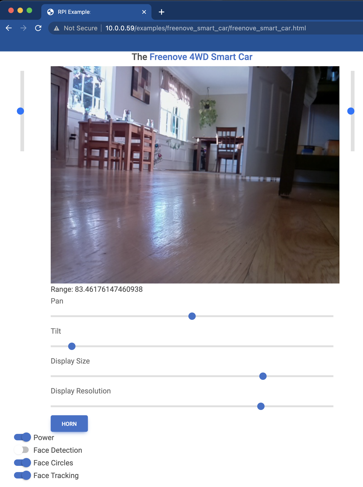

# [Freenove 4WD Smart Car](https://www.amazon.com/Freenove-Raspberry-Tracking-Avoidance-Ultrasonic/dp/B07YD2LT9D)

UNDER CONSTRUCTION



# Enabling the WS281x LED Strip
The WS281x series of LED strips is a popular solution for controllable LEDs, with the benefit that only a single 
pulse-wave modulation (PWM) input signal is needed for control. The Python class for this component is 
[here](https://github.com/MatthewGerber/rpi/blob/5677be3d66cb072b535bed9bf364b0dbd6aa2fc2/src/rpi/gpio/lights.py#L991).
The class itself is straightforward. The difficulty lies in the need to give the Python-side PWM control software
([rpi-ws281x](https://pypi.org/project/rpi-ws281x)) write access to `/dev/mem`. The package writes `/dev/mem` directly
as a means of controlling the PWM signal generated on GPIO-18, which controls the car's LED strip. All of this is fine,
except that the `/dev/mem` device is an image of the system's main memory. As such, the device is highly sensitive and 
locked down by default.

## Unlocking `/dev/mem` for Non-Root Access Immediately Upon Boot
WARNING:  This is a security risk. Do not use this approach unless you understand the security implications. Even if you 
do understand and accept the security implications, this isn't a great idea.

Having issued the above warning, I'll say that this was the easiest approach to implement. It unlocks `/dev/mem` on boot
for user-space programs like the RPI/REST server for the smart car. I wanted this so that I could simply hit the power
button on the car and be driving immediately using the web interface.

Begin by adding the `ubuntu` user to the `kmem` group, which is the default group owner of `/dev/mem`:
```
sudo usermod -a -G kmem ubuntu 
```
Next, give the `kmem` group read/write access to `/dev/mem` upon boot:
```
sudo emacs /etc/udev/rules.d/99-devmem.rules
```
Add `SUBSYSTEM=="mem", KERNEL=="mem|kmem", GROUP="kmem", MODE="0660"` to the file.

The RPI/REST server for the car runs on the [flask](https://palletsprojects.com/p/flask/) framework for Python. Since
access to `/dev/mem` requires both read/write file permissions (set above) and binary capability, we need to add a
binary capability to the Python binary. First, figure out where the binary is:
```
which python  # /home/ubuntu/Repos/rpi/venv/bin/python
ls -l  # /home/ubuntu/Repos/rpi/venv/bin/python  # /home/ubuntu/Repos/rpi/venv/bin/python -> /usr/bin/python3.9
```
Then add the `CAP_SYS_RAWIO` capability to the Python binary:
```
sudo setcap cap_sys_rawio+ep /usr/bin/python3.9
```
Finally, restart to get the group and read/write access to take:
```
sudo shutdown -r now
```

At this point, any user-space program running the Python 3.9 binary will have read/write access to the system's main 
memory. This should make you at least a little uncomfortable, but the LED strip on the car should be working.

## A Safer Alternative:  sudo

# Resources
* [rpi-ws281x Python package for LED strip control](https://pypi.org/project/rpi-ws281x)
* [Why rpi-ws281x requires sudo](https://github.com/jgarff/rpi_ws281x/issues/396)
* [Add CAP_SYS_RAWIO capability](https://unix.stackexchange.com/questions/475800/non-root-read-access-to-dev-mem-by-kmem-group-members-fails)
* [Remove CAP_SYS_RAWIO capability](https://unix.stackexchange.com/questions/303423/unset-setcap-additional-capabilities-on-excutable)
* [Set /dev/mem permissions on boot](https://forums.developer.nvidia.com/t/dev-mem-changes-permissions-back-to-defaults-on-system-restart/65355/3)
